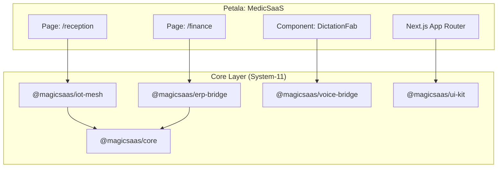
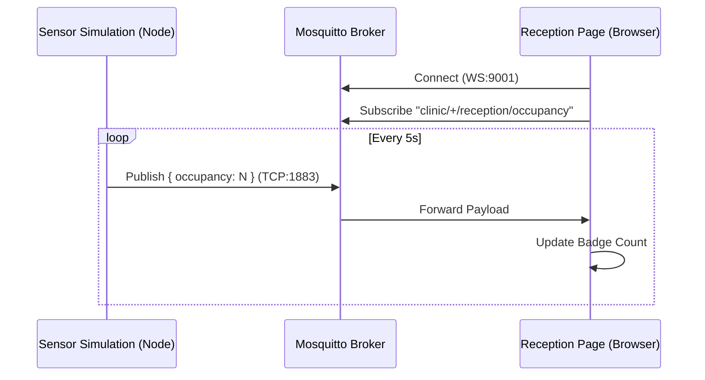

# System-11: Architecture Snapshot (MedicSaaS Pilot)
**Date:** 2025-12-14
**Status:** PHASE 4 COMPLETE / PHASE 3 STARTED
**Version:** 1.0.0 (Pilot)

## 1. High-Level Architecture (The "Petala" Model)

The architecture follows the **Proprietary System-11 Model**, where specific industry applications ("Petalas") inherit from a shared, robust Core ("Stem").

## 2. IoT Mesh Data Flow (Real-Time)

The IoT implementation uses a "Mesh" approach where clients subscribe directly to the broker via WebSockets.

**Flow:**
1.  **Sensor (Simulation):** `simulate-sensor.ts` publishes JSON events to `clinic/default/reception/occupancy`.
2.  **Broker (Mosquitto):** Receives TCP packet on port `1883`. Bridges to WebSocket on port `9001`.
3.  **Client (Browser):** `MqttMeshClient` connects to `ws://localhost:9001` and receives the payload.
4.  **UI:** React State updates -> DOM re-renders.

## 3. Component Details

### 🗣️ Voice Layer (DictationFab)
-   **File:** `src/components/magic/DictationFab.tsx`
-   **Function:** Floating Action Button (FAB) that captures audio (mocked currently).
-   **Integration:** Designed to interface with `VoiceBridgeInstance` (stubs in place).

### 💰 ERP Layer (Finance)
-   **File:** `src/app/finance/page.tsx`
-   **Function:** Displays Financial Overview and Invoice List.
-   **Integration:** Imports types from `@magicsaas/erp-bridge`. Uses `@magicsaas/ui-kit` (Shadcn/UI) for `<Card>` and tables.

### 🏥 Reception Layer (IoT)
-   **File:** `src/app/reception/page.tsx`
-   **Function:** Client-side dashboard for waiting room metrics.
-   **Integration:** Directly instantiates `MqttMeshClient`.

## 4. Infrastructure Stack

| Service | Port | Description |
| :--- | :--- | :--- |
| **Next.js (MedicSaaS)** | 3000 | The Application Frontend/API |
| **Mosquitto** | 1883 / 9001 | MQTT Broker (TCP/WS) |
| **PostgreSQL** | 5432 | Primary Database (ERP/Core) |
| **Redis** | 6379 | Caching / PubSub |
